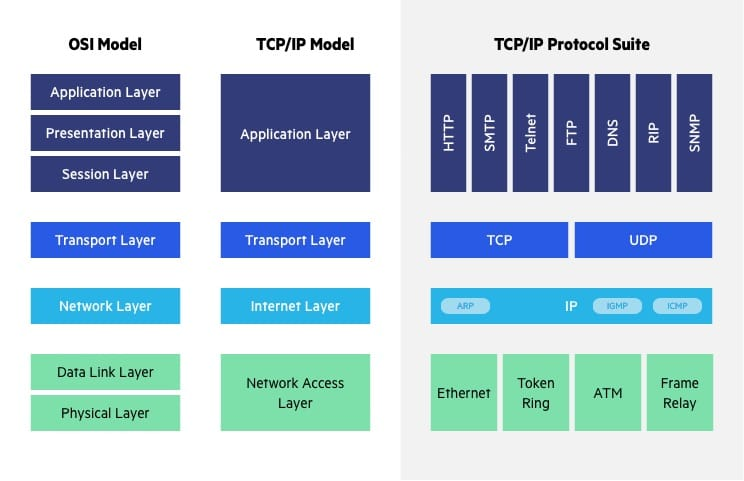

# ARP Poisoning

Execute de proyect wiht Docker
include the Dockerfiles
Include de docker-compse.yaml
include start.sh that automatically  sets up the environment.

Create inquisitor.py

Arguments:
IP-src
MAC-src
IP-target
MAC-target


1.- poisong the arp in both direction (full duplex)
2.- CTRL+C finish the program and restores ARP Table
3.- only work wiht IPv4 addresee
4.- Intercept traffic to a FTP Server
5.- Show in real time file names exchanged between client and server

Sniff packer wiht libcap library
use Raw Sockets

BONUS
Verbose option mode  (-v) shows all FTP Traffic 
---
The aim of this proyect is arp poisonig.
I have to be focused on this aim. Despite that i can be very creative wiht ftp server and client
I will follow Alexander advice "Stay FOcused"

In this spirit:
I will not configure nothing in the Docker with vsftp neither in the Docker with a ftpclient.
---

# Introduction

Address Resolution Protocol (ARP) is a protocol that enables network communications to reach a specific device on the network. ARP translates Internet Protocol (IP) addresses to a Media Access Control (MAC) address, and vice versa (RARP Protocol). It is a Network Layer protocol (OSI Model). ARP Was introduced in the RFC 826 in 1982. Most commonly, devices use ARP to contact the router or gateway that enables them to connect to the Internet.




Each host maintains an ARP cache, a mapping table between IP addresses and MAC addresses, and use it to connect to destinations on the network. 

If the host doesn’t know the MAC address for a certain IP address, it sends out an ARP request packet, asking other machines on the network for the matching MAC address. 

The ARP protocol was **not designed for security**, so it does not verify that a response to an ARP request really comes from an authorized party. It also lets hosts **accept ARP responses even if they never sent out a request**. This is a weak point in the ARP protocol, which opens the door to ARP spoofing attacks.

ARP only works with 32-bit IP addresses in the older IPv4 standard. The newer IPv6 protocol uses a different protocol, Neighbor Discovery Protocol (NDP), which is secure and uses cryptographic keys to verify host identities. However, since most of the Internet still uses the older IPv4 protocol, ARP remains in wide use.

In this exercise, the subject establishes that inquisitor.py receives four parameters (IP-src, MAC-src,IP-target,MAC-target) meaning that the script does not need to discover data from the server or the victim broadcasting ARP Requests.

Inquisitor only has to send forged ARP reply packages
Sniff traffic between server and victim filtering FTP Packets
Restablish ARP tables status

# ARP Reply packet

Please read the code inside  the script to see how i created chunks of bytearray.
ARP_reply is the payload of an ether packet sent with Socket module.

```

```


---
# Environment set up
The environment for this exericses consists of three docker containers.
* One for the ftp server FROM alpine:3.13 (215 MB).
* One for the ftp client FROM alpine:3.13 (012 MB).
* One for the attackant  FROM python:3    (956 MB).


Intentionally i limitied the functionality of this exercise. Instead of discovering the IP and MACs from the attackent docker, the Docker-compose settled IPS and MACs  for all machines. 

Inside Docker Engine i created my own network: 192.168.42.0/24  (of course, 42, we are at 42 Barcelona)

```
networks:
  spoof_net:
    ipam:
      driver: default
      config:
        - subnet: "192.168.42.0/24"
```
the right configurations options made the job

```
victim:
    build: ./victim
    image: victim
    container_name: victim
    hostname: victim #optional
    networks:
      spoof_net:
        ipv4_address : 192.168.42.3
    mac_address: 02:42:c0:a8:2a:03
```


## initial status

Just after Docker compose finish set up this is the individual arp table status
of each host.
------------------------------- victim arp table -------------------------------
IP address       HW type     Flags       HW address            Mask     Device
------------------------------- server arp table -------------------------------
IP address       HW type     Flags       HW address            Mask     Device
------------------------------- attack arp table -------------------------------
IP address       HW type     Flags       HW address            Mask     Device

## Status after victim conects to server

------------------------------- victim arp table -------------------------------
IP address       HW type     Flags       HW address            Mask     Device
192.168.42.2     0x1         0x2         02:42:c0:a8:2a:02     *        eth0
------------------------------- server arp table -------------------------------
IP address       HW type     Flags       HW address            Mask     Device
192.168.42.3     0x1         0x2         02:42:c0:a8:2a:03     *        eth0
------------------------------- attack arp table -------------------------------
IP address       HW type     Flags       HW address            Mask     Device

## Attackant

This is redundant accordingly to the settled environment.
The script uses argaparse argument validation funcions to check that either IPs (def correct_ip(text):) and MACs (def correct_mac(text):) passed as argument are syntactically correct.

The script verifies (def all_in_network (IPv4_a1, IPv4_a2, IPv4_a3) -> bool:) that the server, the victim and the attackant are in the same network 


---
# Stones found
libpcap.so was not in docker python:3 image. i got OSError: Cannot find libpcap.so library when python import lippcab

As a newbie, i used  WireShark for a better understanding of what i was doing.


Learn to use Sockets inside docker

Make volume inside docker attack.
I edited code with visual studio code in my host machine that was ready inside container por execution 
---
# helper bash scripts
## show_arp_tables.sh
Usexs docker exec function to execute a bash commnad inside the contaner
echo "------------------------------- victim arp table -------------------------------"
docker exec victim cat /proc/net/arp

---
# References
[arp introduction ](https://www.imperva.com/learn/application-security/arp-spoofing/)

[python modules and docker](https://pythonspeed.com/articles/importerror-docker/)

[RFC 826](https://datatracker.ietf.org/doc/html/rfc826)

[ARP reply packet structure](https://www.oreilly.com/library/view/packet-guide-to/9781449308094/ch04.html)

[libpcap Tutorial](http://e-ghost.deusto.es/docs/2005/conferencias/pcap.pdf)